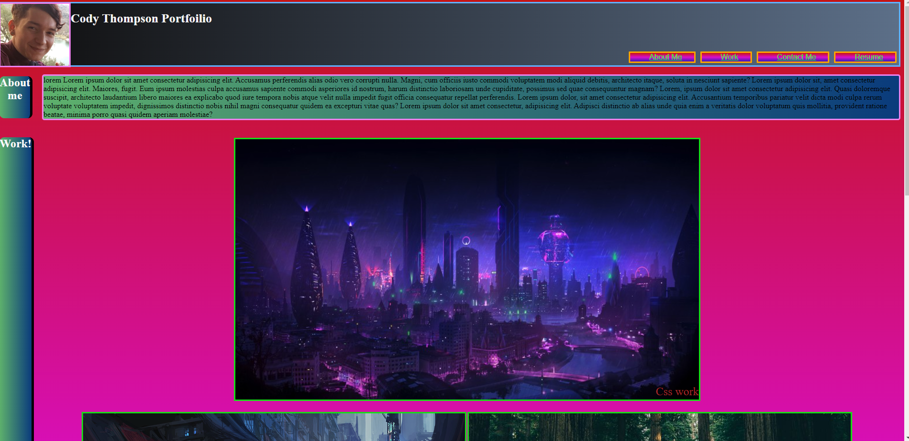

# Second Week Challenge - Challenge 2

## Description

Second week challenge Challenge, showing my ability to use CSS and Flex materials. As well as use semantic tags to standards while meeting my own wants aned needs. Additionally showcases my ability to debug any issues that come along.

## Links

Github Link: https://github.com/codyleight/challenge2
Deployed Website : https://codyleight.github.io/challenge2/

## Usage

A showcase for a buisness resume, showcasing working links, pictures with links as well as text, spacing etc. Also provides flex so the content will adjust to screen size.
## Credits

Cody Thompson
Repo location on pc: - C:\Users\JC\Desktop\Bootcamp2\challenge2
used w3 schools and other examples.

I did help out Jason Mason, and Bijan Olfati so some of their code may similar to mine.

## Photo Preview of Website
 

